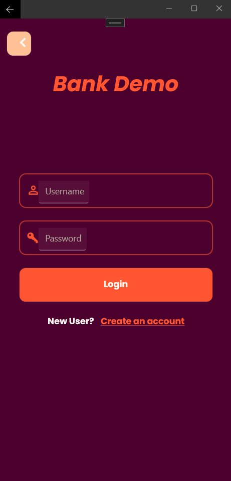
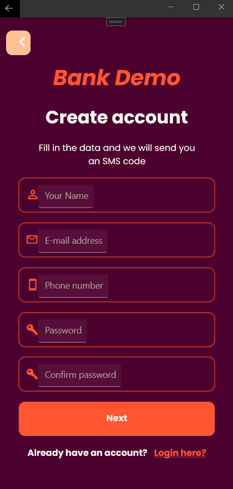

# .NET MAUI Login Design
Simple UI design without any true back-end features. Just to test UI customization features
of .NET MAUI and changing pages/views.

 

## Here you can see some screenshots of the UI design
 

### Screen capture of the main home screen of the app

  

### Screen capture of the main login screen of the app

  

### Screen capture of the main register screen of the app

